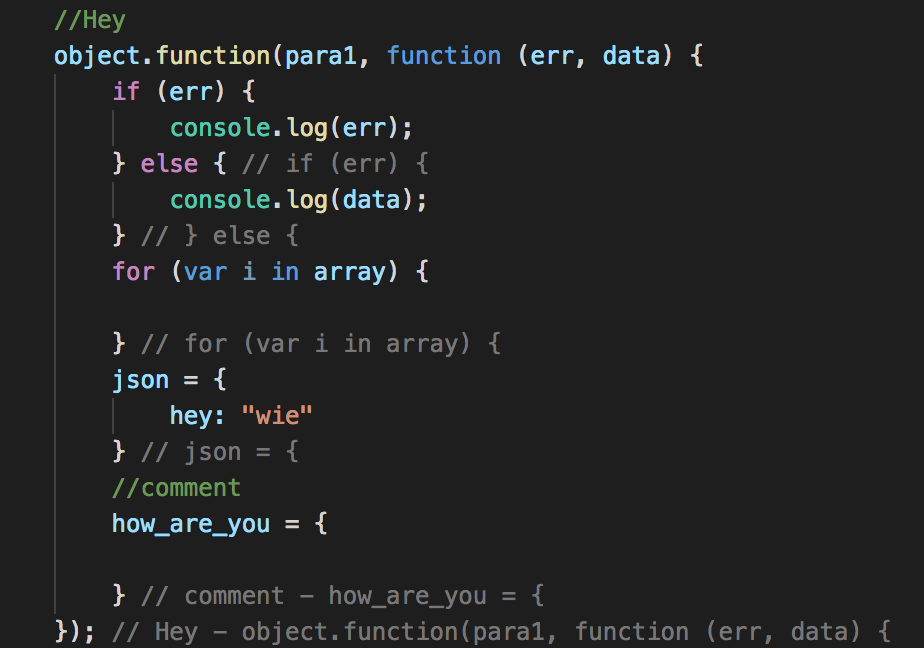
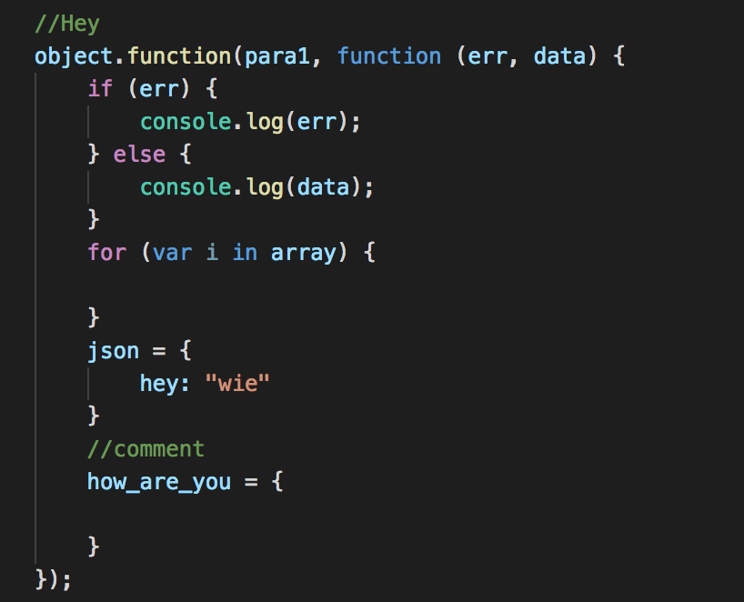

# LabelClosing

This is a small extension for JavaScript files. 
It labels the closing bracket with the opening bracket line. 

With the extension:  

Without:  

When hovering over the comment it will show you the max 4 next lines of the opening line.

